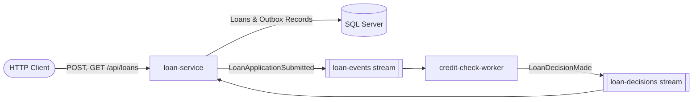
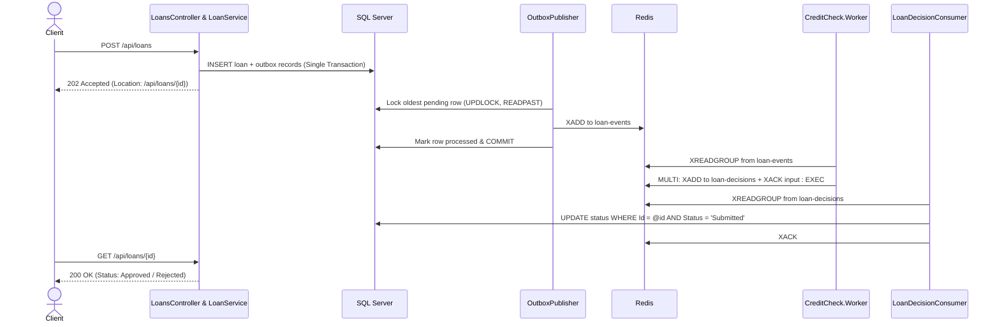

# Loan Settlement Service

Two .NET 10 services that coordinate distributed loan application processing through Redis Streams using the Transactional Outbox pattern:

* **`loan-service`**: An ASP.NET Core Web API that records loans and outbox events in a single atomic SQL Server transaction, asynchronously dispatches events to Redis Streams via background workers, and processes incoming decisions.

* **`credit-check-worker`**: An asynchronous background service that consumes submitted loan events from Redis Streams, evaluates business credit rules, and emits decisions.

Stack: .NET 10, ASP.NET Core, EF Core 10, SQL Server 2022, StackExchange.Redis, xUnit, Testcontainers, and Docker Compose.

---

## Architecture & Workflow





---

## System Design & Guarantees

### Transactional Outbox Pattern

* **Atomic Persistence:** `POST /api/loans` creates the `LoanApplication` entity and the corresponding `OutboxMessage` row within a single EF Core `SaveChangesAsync` database transaction, preventing dual-write inconsistencies.

* **Concurrency & Locking:** `OutboxPublisher` polls pending outbox entries using `WITH (UPDLOCK, READPAST, ROWLOCK)`. `UPDLOCK` prevents concurrent worker modification, while `READPAST` instructs concurrent worker instances to skip locked rows without blocking.

* **Failure Handling:** Network disconnections or timeouts against Redis roll back the database transaction without incrementing attempt counts. Application-level dispatch failures increment `AttemptCount` up to 5 times before requiring manual operational review.

### Idempotent Stream Processing

* **Atomic State Transition:** `LoanDecisionConsumer` applies stream decisions using a single conditional SQL update:
```sql
UPDATE LoanApplications SET Status = @newStatus WHERE Id = @loanId AND Status = 'Submitted'

```

Duplicate or out-of-order events make zero row modifications and are safe to acknowledge.

* **Consumer Group Guarantees:** Consumers register fixed consumer group identifiers. On startup, workers read pending unacknowledged entries (`XREADGROUP` starting at `0`) to clear in-flight messages from crashes before polling new events (`>`).

* **Atomic Worker Dispatches:** `credit-check-worker` groups decision emission (`XADD`) and source-event acknowledgment (`XACK`) into a single atomic Redis `MULTI`/`EXEC` block.

---

## Project Structure

```text
loan-service/
  Loans.Api/
    Controllers/          # HTTP endpoints
    BackgroundServices/   # OutboxPublisher & LoanDecisionConsumer loops
    Services/             # Business rules and orchestration
    Repositories/         # SQL persistence and query operations
    Data/                 # DbContext and EF Core migrations
    Models/               # Domain entities and enums
    Dtos/                 # HTTP API contracts
    Messages/             # Redis Streams serialization schemas
  Loans.Api.Tests/        # Unit and integration test suites
credit-check-worker/
  CreditCheck.Worker/     # Stream consumer and credit decision policy
  CreditCheck.Worker.Tests/
docker-compose.yml        # Multi-container orchestration (SQL, Redis, Services)

```

---

## Running the Application

### Via Docker Compose

Builds images, provisions SQL Server and Redis, applies EF Core database migrations, and boots both services:

```bash
docker compose up --build -d --wait

```

Submit a test loan application:

```bash
curl -i -X POST http://localhost:5135/api/loans \
  -H 'Content-Type: application/json' \
  -d '{"borrowerName":"Ada Lovelace","amount":12500,"currency":"EUR"}'

```

Query the loan status using the ID returned in the `Location` header:

```bash
curl -i http://localhost:5135/api/loans/{id}

```

Stop and clear infrastructure:

```bash
docker compose down -v

```

### Local Development (`dotnet run`)

Start the supporting infrastructure:

```bash
docker compose up -d --wait sqlserver redis

```

Run each service in separate terminal sessions:

```bash
dotnet run --project loan-service/Loans.Api

```

```bash
dotnet run --project credit-check-worker/CreditCheck.Worker

```

---

## Test Suite

Tests execute via xUnit and utilize Testcontainers to spin up isolated SQL Server and Redis instances for integration suites:

```bash
dotnet test loan-service/LoanService.slnx
dotnet test credit-check-worker/CreditCheck.slnx

```

* **Unit Tests:** Validates currency precision rules, outbox serialization formats, payload parsing constraints, and credit policy thresholds via mock repositories.

* **Integration Tests:** Verifies concurrent publisher deduplication, crash recovery of unacked stream entries, transient network failure rollbacks, and idempotency guarantees against duplicate decision deliveries.
